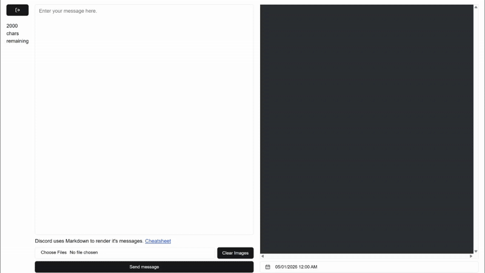

# SAFA Announcement Scheduler

## ✍ About

As the Event Coordinator for SAFA (Student Association of Filipino Americans), I observed that me and my fellow e-board members would often have to schedule posts either by mentally remembering or writing it down on a to-do list. This was the inspiration for this project.


I wanted to streamline this process by creating a tool that would schedule Discord announcements via an accessible web dashboard.

> Note: The web dashboard is purposely password locked to prohibit the public from scheduling announcements

## 🗺️ System Architecture


## 🧰 Technologies Used
1. NextJS 15 (and it's respective technologies i.e. React, Tailwind)
2. NextJS App Router
3. AWS Lambda
4. AWS EventBridge Scheduler
5. AWS S3

## 📂 General Portfolio Structure
```
safa-message-scheduler/
├── frontend/                         # Frontend components and pages
│   ├── src/
│   │   └── app/
│   │       ├── api/auth/[kindeAuth]  # Callback API endpoint for Kinde authentication
│   │       ├── dashboard             # Scheduling dashboard frontend code
│   │       ├── scheduled-posts       # A "Scheduled Posts" page that is currently not implemented
│   │       └── send-message          # API route for creating EventBridge Schedules
└── aws/                              # The Python code that's currently deployed to AWS Lambda
```

## 🤝 Contributing
If you're interested in contributing to this project, please reach out to @krayontheman on Discord. Send a DM explaining how you'd like to contribute and friend request so that I know that you aren't a bot.

When submitting changes, please do so via a Pull Request. In your PR description, clearly explain what you changed, what you implemented, and include screenshots if necessary to illustrate your changes.

### ▶️ Running the App
> Note: I use [`pnpm`](https://pnpm.io/installation) for my package manager to save disk space on my computer, please use it when working with this project.

The `frontend` directory is just a NextJS 15 application. As such:

1. `cd frontend`
2. `pnpm install`
3. `pnpm run dev`

Make sure to also use the necessary environment variables and store them in a `.env.local` file in the root  of the `frontend` directory.

_Made with ❤️ by [krayondev](https://x.com/krayondev)_
